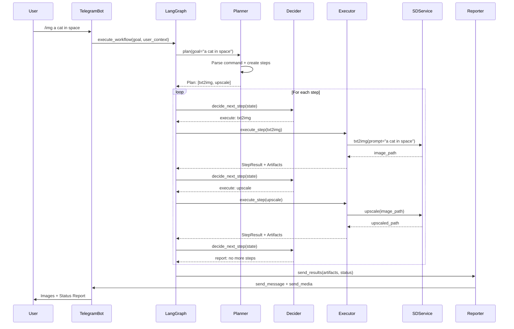

# LangGraph Orchestrator - Architektur Übersicht

## Überblick

Der LangGraph Orchestrator ist das Herzstück des German Code Zero AI Systems. Er koordiniert die Ausführung komplexer Multi-Step Workflows über eine state-basierte Graph-Architektur.

## Architektur-Diagramm

```mermaid
graph TD
    %% Entry Point
    START([User Goal: "/img prompt"]) --> PLANNER[🧠 Planner Node]
    
    %% Planning Phase
    PLANNER --> |"Plan erstellt<br/>txt2img → upscale"| DECIDER{🎯 Decider Node}
    
    %% Decision Logic
    DECIDER --> |"execute"| EXECUTOR[⚙️ Executor Node]
    DECIDER --> |"report"| REPORTER[📊 Reporter Node]
    DECIDER --> |"end"| END([END])
    
    %% Execution Loop
    EXECUTOR --> |"Step completed<br/>Back to decision"| DECIDER
    
    %% Final Reporting
    REPORTER --> |"Results sent<br/>to Telegram"| END
    
    %% State Management
    STATE[(🗃️ GraphState)]
    PLANNER -.-> STATE
    DECIDER -.-> STATE
    EXECUTOR -.-> STATE
    REPORTER -.-> STATE
    
    %% Service Integration
    EXECUTOR --> SD_SERVICE[🎨 SDService]
    EXECUTOR --> ANIM_SERVICE[🎬 AnimService]
    EXECUTOR --> UPLOAD_SERVICE[📤 UploadService]
    EXECUTOR --> ASR_SERVICE[🎙️ ASRService]
    
    %% Styling
    classDef nodeStyle fill:#e1f5fe,stroke:#01579b,stroke-width:2px
    classDef decisionStyle fill:#fff3e0,stroke:#e65100,stroke-width:2px
    classDef executorStyle fill:#f3e5f5,stroke:#4a148c,stroke-width:2px
    classDef reporterStyle fill:#e8f5e8,stroke:#1b5e20,stroke-width:2px
    classDef stateStyle fill:#fce4ec,stroke:#880e4f,stroke-width:3px
    classDef serviceStyle fill:#f1f8e9,stroke:#33691e,stroke-width:1px
    
    class PLANNER nodeStyle
    class DECIDER decisionStyle
    class EXECUTOR executorStyle
    class REPORTER reporterStyle
    class STATE stateStyle
    class SD_SERVICE,ANIM_SERVICE,UPLOAD_SERVICE,ASR_SERVICE serviceStyle
```

## Core-Komponenten

### 1. GraphState - Zentraler Zustand

**Zweck:** Verwaltet den kompletten Workflow-Zustand serialisierbar und crash-safe.

**Hauptfelder:**
- `session_id`: Eindeutige Session-Identifikation
- `user`: Benutzer-Kontext mit Rollen und Permissions
- `goal`: Original-Benutzeranfrage (z.B. "/img a cat in space")
- `plan`: Liste von PlanItems (Steps) mit Dependencies
- `artifacts`: Generierte Dateien (Bilder, Videos, Audio)
- `errors`: Fehler-Historie mit Severity-Levels
- `context`: Shared context zwischen Steps

**Serialisierung:** JSON-kompatibel für Persistierung und Recovery.

### 2. PlannerNode - Intelligente Workflow-Erstellung

**Eingabe:** User Goal String
**Ausgabe:** Strukturierter Execution-Plan

**Funktionen:**
- **Command-Parsing:** Erkennt `/img`, `/anim`, `/upload` etc.
- **Dependency-Resolution:** Erstellt korrekte Step-Reihenfolgen
- **Role-Based Planning:** Berücksichtigt User-Permissions
- **Fallback-Logic:** Intelligentes Parsing für unstrukturierte Goals

**Beispiel-Plan für "/img a cat":**
```yaml
steps:
  - id: step_001
    action: txt2img
    params: {prompt: "a cat", model: "sd15"}
    dependencies: []
  - id: step_002  
    action: upscale
    params: {scale_factor: 2}
    dependencies: [step_001]
```

### 3. DeciderNode - Execution-Steuerung

**Zweck:** Entscheidet über den nächsten auszuführenden Step.

**Decision-Logic:**
1. **Completion Check:** Alle Steps completed?
2. **Error Evaluation:** Kritische Fehler vorhanden?
3. **Dependency Check:** Dependencies erfüllt?
4. **Resource Availability:** GPU/Memory verfügbar?
5. **Retry Logic:** Fehlgeschlagene Steps retry-fähig?

**Policies:**
- Max. 1 GPU-Task parallel
- Retry-Budget Management
- Circuit-Breaker Pattern für häufige Fehler

### 4. ExecutorNode - Service-Integration

**Zweck:** Führt einzelne Steps über Service-APIs aus.

**Integration-Modi:**
1. **Direct Service Call:** Direkter Import und Aufruf (Performance)
2. **Workflow Engine API:** Fallback für komplexe Workflows
3. **Error Handling:** Umfassende Fehlerbehandlung und Retry-Logic

**Service-Mappings:**
- `txt2img` → `SDService.txt2img()`
- `upscale` → `SDService.upscale()`
- `anim` → `AnimService.create_animation()`
- `upload_youtube` → `YouTubeService.upload_video()`

### 5. ReporterNode - Result-Delivery

**Zweck:** Sendet finale Ergebnisse an Telegram.

**Report-Komponenten:**
- **Status-Message:** Execution-Statistiken und Zusammenfassung
- **Artifacts:** Bilder, Videos, Audio-Dateien
- **Error-Summary:** Fehlgeschlagene Steps (falls vorhanden)

**Telegram-Integration:**
- Media Groups für mehrere Bilder
- Individual Uploads für Videos
- Markdown-formatierte Status-Nachrichten

## Workflow-Execution Flow

### Standard-Ablauf für "/img prompt"



## Failure-Modes & Recovery

### 1. Service-Failures

**Scenario:** SDService crashes during txt2img

**Recovery:**
```yaml
Detection: Exception caught in ExecutorNode
Action: 
  - Mark step as FAILED
  - Increment retry_count
  - Add error to state
  - Return to DeciderNode
Retry Logic:
  - If retry_count < max_retries: retry step
  - Else: mark step as permanently failed
  - Continue with remaining independent steps
```

### 2. Resource-Exhaustion

**Scenario:** GPU memory full

**Recovery:**
```yaml
Detection: GPU resource check in DeciderNode  
Action:
  - Return "resources not available"
  - Wait for running GPU tasks to complete
  - Implement exponential backoff
  - Circuit breaker after repeated failures
```

### 3. Critical System Errors

**Scenario:** File system full, authentication failure

**Recovery:**
```yaml
Detection: Critical error classification
Action:
  - Immediately mark workflow as FAILED
  - Skip remaining steps
  - Send error report to user
  - Log for admin intervention
```

### 4. State Corruption

**Scenario:** Process crash during execution

**Recovery:**
```yaml
Prevention: 
  - State snapshots every 5 steps
  - JSON serializable state design
  - Atomic state updates
Recovery:
  - Restore from latest snapshot
  - Resume from last completed step
  - Validate state integrity
```

### 5. Network/External Service Failures

**Scenario:** YouTube API rate limit, ComfyUI timeout

**Recovery:**
```yaml
Detection: API response codes, timeouts
Action:
  - Exponential backoff retry
  - Circuit breaker pattern  
  - Graceful degradation (skip uploads)
  - User notification of partial success
```

## Performance Characteristics

### Expected Execution Times

| Workflow Type | Steps | Avg. Time | 95th Percentile |
|---------------|-------|-----------|-----------------|
| Simple Image  | 2     | 30s       | 60s            |
| Image + Upload| 3     | 90s       | 180s           |
| Animation     | 3     | 120s      | 300s           |
| Multi-Modal   | 5+    | 300s      | 600s           |

### Resource Utilization

- **GPU:** Single-task execution, 70-90% utilization during inference
- **Memory:** 8-16GB for SD models, auto-cleanup after steps
- **Storage:** Artifacts retained for 30 days, auto-cleanup
- **Network:** Burst uploads to social media platforms

## Configuration & Policies

### Role-Based Restrictions

```yaml
Guest Users:
  - Max 3 steps per workflow
  - No upscale/animation
  - No social media uploads
  
Regular Users:
  - Max 15 steps per workflow  
  - Full image generation
  - YouTube/TikTok uploads
  
Admins:
  - No restrictions
  - Full feature access
  - Enhanced monitoring
```

### Resource Policies

```yaml
GPU Management:
  - 1 parallel task maximum
  - 5min timeout per task
  - 10s cooldown between tasks
  
Retry Policies:
  - Global budget: 10 retries
  - Per-step limits: 1-3 retries
  - Exponential backoff
```

## Integration Points

### Telegram Bot Integration

```python
# Simple integration example
from ai.graph.core_graph import execute_workflow

async def handle_img_command(update, context):
    goal = update.message.text  # "/img a cat"
    user_context = {
        "user_id": update.effective_user.id,
        "username": update.effective_user.username,
        "role": "user",
        "telegram_chat_id": update.effective_chat.id
    }
    
    final_state = await execute_workflow(goal, user_context)
    # Results automatically sent via ReporterNode
```

### Monitoring Integration

```python
# Performance tracking
from ai.graph.core_graph import create_orchestrator

orchestrator = create_orchestrator()
final_state = await orchestrator.execute(initial_state)

metrics = orchestrator.get_state_summary(final_state)
# metrics: {execution_time, artifacts_count, errors_count, ...}
```

## Future Enhancements

### Planned Features

1. **Parallel Execution:** Independent steps run simultaneously
2. **LLM-based Planning:** GPT-4 for complex workflow planning
3. **Dynamic Resource Scaling:** Auto-scale GPU resources
4. **Workflow Templates:** Pre-defined templates for common tasks
5. **A/B Testing:** Experiment with different planning strategies

### Scaling Considerations

- **Horizontal Scaling:** Multiple orchestrator instances
- **State Sharding:** Distribute state across multiple backends
- **Service Mesh:** Microservice architecture for services
- **Event-Driven:** Async event processing for better throughput